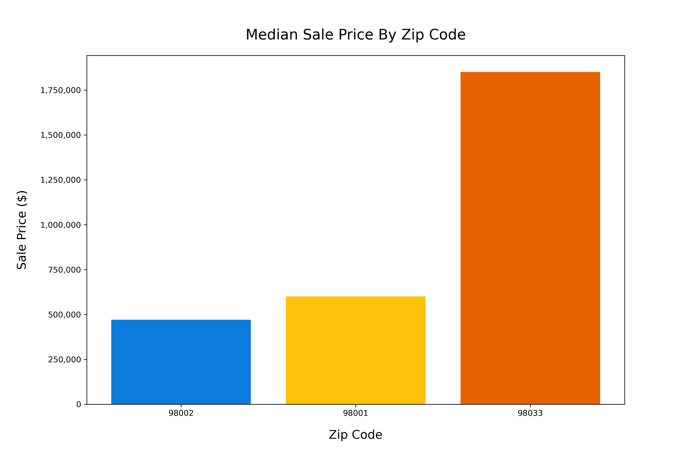

# King County Residential Real Estate Anlaysis


**Authors**:

Clara Giurgiu
<br>
Stephanie Ciaccia

## Overview

Panda Real Estate is a residential real estate firm that prioritizes leveraging technology to enhance and optimize their real estate portfolio. Historically operating in the greater New York City Area, Panda Real Estate has decided to expand its portfolio to the west coast, to include properties in King County, Washington.

## Business Problem

As Panda Real Estate expands its market to the greater Seattle Metropolitan area, we will be identifying the key variables that influence residential home prices in King County, Washington. By conducting a thorough exploration of the various variables that can impact home prices, we hope to inform internal investment teams on the residential housing market.

## Data

- **King County Data** - We used a dataset from [King County Open Data](https://gis-kingcounty.opendata.arcgis.com/) that includes over 30K home sales from 2021-2022 with prices ranging from $27,000 - $30,000,000. Variables inlcuded in this dataset include a variety of physical and environmental variables such as: home size, condition of home, location. 


- **FRED Economic Data** - This dataset was pulled from [Economic Research - Federal Reserve Bank of St. Louis](https://fred.stlouisfed.org/series/MORTGAGE30US). It includes monthly mortage rates from the past 30 years.

## Methods

To perform our inferential analysis, we created a simple linear regression and multiple linear regressions to examine the relationship between the price, our dependent variable, and a variety of independent variables. Our final model was a **multiple linear regression** with both numerical and categorical variables. Variables include:

- square foot living space
- construction grade 
- zip code 
- bedroom
- bathroom
- view
- waterfront
- mortgage rates

## Results

From our model, we identified the top predictors that impact price:

- square foot living space
- zip code 
- construction grade 

### Home Size
- Increasing footage of home by approximately 964 sq. ft. increases the price by a factor of 1.227 or **22.7%**.


### Proximity to Seattle
- When compared to our reference point of zip code 98001, Auburn, which is associated with the city of Federal Way, we observed that relocating to zip codes located to the north and closer to Seattle, as well as more urban cities like Kirkland (98033), results in a **14.6%** increase in the sale price. However, if one were to remain in close proximity to Federal Way and avoid Seattle, there would be a slight decrease in sale prices. This is evident from the comparison to zip code 98002, which corresponds to Auburn city and resulted in a price decrease of **1.04%**.



### Construction Grade
- It is evident that the quality of construction has a significant impact on prices. A decline in construction quality is linked to a reduction in sale prices. For instance, the transition from a construction grade of 10 to 7 results in a decrease of **13.3%** in prices.


## Conclusions

As a result of this analysis, three variables have been identified that can impact prices and should be taken into consideration when researching potential investment properties:

- **Home Size**: There is a direct positive correlation between home square foot living space and the sale price.
    
- **Proximity to Seattle**: Homes closer to Seattle have higher sale prices.

<p align="center">
    

- **Construction Grade**: The quality of construction has a significant impact on prices.

## Next Steps

To gain a more comprehensive understanding of changing home prices, it would be beneficial to analyze additional historical home sale data beyond the current dataset that only spans 12 months. Reviewing home sales over the past 5-10 years can provide insights into how the housing market has evolved.

In addition to historical data, conducting further analyses of environmental variables can enhance our understanding of residential home prices and should be taken into consideration. Some factors to consider include:

- School district ratings and locations
- Tax data
- Population data

## For More Information

See the full analysis in the [Jupyter Notebook](https://github.com/claragiurgiu/Phase2-Project/blob/main/King_County_Analysis.ipynb)

## Repository Structure

```
├── Data
    ├──archive
├── Images
├── .gitignore
├── King_County_Analysis.ipynb
├── King_County_Analysis_Presentation.pdf
├── LICENSE
└── README.md